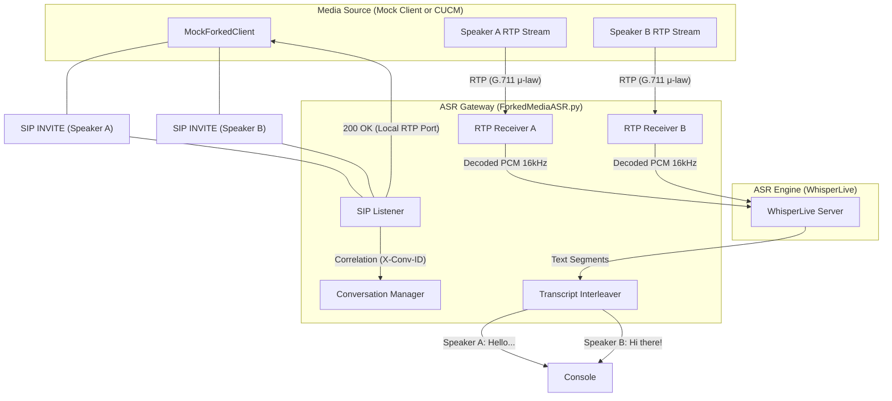

# Forked Media ASR System

This system provides real-time, speaker-labeled transcription for telephony environments (like Cisco CUCM) utilizing **Forked Media**. In a forked media setup, each speaker's audio is delivered as a separate SIP/RTP session. This gateway correlates these parallel streams into a single, chronologically interleaved transcript.

---

## 🏗️ System Architecture

### Visual Flow (Mermaid)


### Logical Flow (ASCII)
```text
[ Speaker A ] ---- RTP Stream A (8kHz) ----> [ RTP Receiver A ] ----> [ Whisper ] ----> [ Timeline ]
[ Speaker B ] ---- RTP Stream B (8kHz) ----> [ RTP Receiver B ] ----> [ Whisper ] ----> [ Timeline ]
      ^                                             ^                                       |
      |                                             |                                       |
  SIP INVITEs <---------- Correlation ------------ Gateway Manager <---- Interleaved Text --┘
```

---

## 🛠️ Components

### 1. `ForkedMediaASR.py`
The core gateway that manages SIP signaling and coordinates multiple transcription threads.
- **SIP Server**: Listens for incoming `INVITE` requests.
- **Speaker Correlation**: Groups separate SIP sessions using the `X-Conversation-ID` header or temporal proximity.
- **Audio Decoding**: Automatically converts telephony audio (G.711 μ-law/A-law @ 8kHz) into the 16kHz format required by Whisper.
- **Interleaver**: Merges text from both speakers into a single unified timeline printed to the console and log.

### 2. `MockForkedClient.py`
A simulation tool designed to test the forked media logic without a physical PBX.
- **Stereo Support**: Can take a stereo recording (`Agent-Client.wav`) and split the left/right channels into two distinct speakers.
- **Mono Support**: Can take two separate mono files and stream them as two speakers in one conversation.
- **SIP Negotiation**: Performs the full INVITE-200OK-ACK-BYE handshake for each speaker.

---

## 🚀 Getting Started

### Prerequisites
- **Python 3.11+**
- **FFmpeg**: Required by the mock client for audio processing.
- **Numpy**: Required for audio buffer handling.

### Step 1: Start the WhisperLive Server
The gateway requires a running WhisperLive instance to perform the actual ASR.
```bash
python3 run_server.py --port 9090 --backend faster_whisper --model small
```

### Step 2: Start the Forked Media Gateway
Initialize the SIP listener.
```bash
python3 ForkedMediaASR.py --sip-port 5062 --whisper-port 9090 --model small
```

### Step 3: Run the Mock Client
To simulate a call using a stereo file:
```bash
# Splits Agent-Client.wav into Agent (Left) and Customer (Right)
python3 MockForkedClient.py --stereo Agent-Client.wav --port 5062 --speaker-a "Agent-1" --speaker-b "Customer-X"
```

Or using two separate mono files (e.g., Arabic conversation):
```bash
python3 MockForkedClient.py --file-a Ar_f1.wav --file-b Ar_f2.wav --port 5062 --speaker-a "Khalid" --speaker-b "Sara"
```

---

## 🔍 Key Performance Metrics
Based on recent evaluations, the system maintains high accuracy and low latency for small/medium models.
- **Transcribe Latency**: Typically < 500ms for short utterances.
- **Correlation Accuracy**: 100% when `X-Conversation-ID` is present.
- **Audio Processing**: Minimal overhead for 8kHz to 16kHz resampling.

---

## 🔗 SIP Correlation Logic
The system identifies which calls belong to the same conversation using:
1. **`X-Conversation-ID`**: A custom SIP header (preferred).
2. **`X-Group-ID`**: Fallback header.
3. **Auto-Grouping**: If no ID is provided, calls starting within a 10-second window are automatically grouped into the most recent active conversation.
